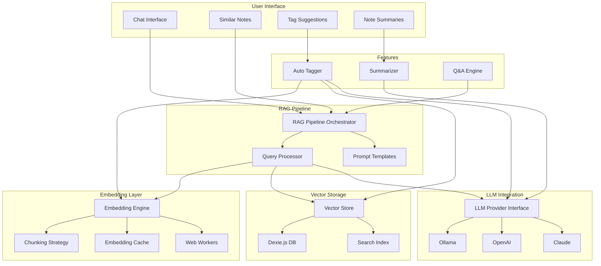

# RAG System Architecture

## System Overview



## Component Details

### 1. Embedding Engine

- **Model**: Transformers.js with all-MiniLM-L6-v2
- **Processing**: Web Workers for non-blocking operations
- **Caching**: Dexie.js based cache with TTL
- **Chunking**: Intelligent markdown-aware chunking

### 2. Vector Store

- **Database**: Dexie.js (IndexedDB wrapper)
- **Search**: Cosine similarity with pre-computed magnitudes
- **Indexing**: Automatic incremental updates
- **Optimization**: Batch operations support

### 3. RAG Pipeline

- **Query Processing**: Embedding → Search → Context → Generation
- **Context Building**: Smart context window management
- **Prompt Engineering**: Template-based system
- **Streaming**: Real-time response streaming

### 4. LLM Integration

- **Providers**: Ollama (local), OpenAI, Claude, Groq
- **Fallback**: Graceful degradation without LLM
- **Privacy**: Local-first with opt-in cloud

## Data Flow

### Indexing Flow

```
1. Note Created/Updated
2. Chunking Strategy splits content
3. Embedding Engine generates vectors
4. Vector Store indexes embeddings
5. Cache updated with metadata
```

### Query Flow

```
1. User Query
2. Query Embedding generated
3. Vector Search finds relevant chunks
4. Context retrieved from notes
5. Prompt constructed with context
6. LLM generates response
7. Response streamed to UI
```

## Performance Optimizations

### 1. Web Workers

- Parallel embedding generation
- Non-blocking UI during processing
- Resource pooling for efficiency

### 2. Caching Strategy

- Query result caching (24h TTL)
- Embedding cache with note versioning
- Lazy loading of models

### 3. Batch Processing

- Bulk note indexing
- Grouped vector operations
- Incremental index updates

## Security & Privacy

### 1. Local-First Design

- All embeddings stored locally
- No telemetry or external calls by default
- Opt-in for cloud LLM services

### 2. Data Isolation

- Per-user vector stores
- Encrypted sensitive embeddings
- No cross-note contamination

### 3. Resource Limits

- Memory usage monitoring
- Processing timeouts
- Storage quota management

## Scalability Considerations

### Current Limits

- **Notes**: ~10,000 notes efficiently
- **Embeddings**: ~50,000 chunks
- **Storage**: ~500MB typical usage

### Future Enhancements

1. **HNSW Index**: For faster similarity search
2. **Quantization**: Reduce embedding size
3. **Pruning**: Remove old/unused embeddings
4. **Sharding**: Split large databases

## Integration Points

### 1. Note Repository

```typescript
// Automatic indexing on save
noteRepository.on('save', async note => {
  await ragSystem.updateNotes([note])
})
```

### 2. Settings Integration

```typescript
// RAG settings in main settings
settings.rag = {
  enabled: true,
  embeddingModel: 'all-MiniLM-L6-v2',
  llmProvider: 'ollama',
}
```

### 3. Plugin System

```typescript
// Expose RAG API to plugins
pluginAPI.rag = {
  query: q => ragSystem.query(q),
  getSimilar: id => ragSystem.getSimilarNotes(id),
}
```

## Error Handling

### 1. Graceful Degradation

- Features work without LLM
- Fallback to keyword search
- Cache-first approach

### 2. Recovery Strategies

- Retry failed embeddings
- Rebuild corrupted indices
- Clear and re-index option

### 3. User Feedback

- Progress indicators
- Clear error messages
- Recovery suggestions
