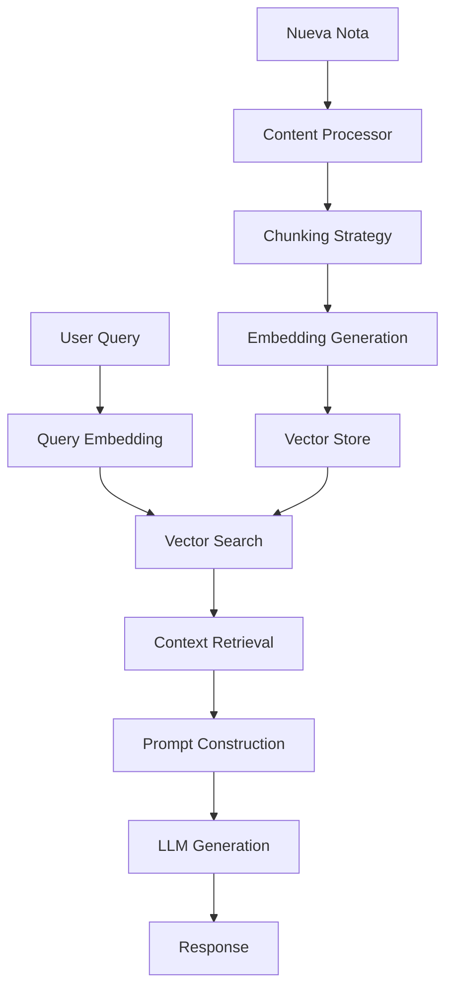

# Sistema RAG (Retrieval-Augmented Generation) para Viny

## Arquitectura General

```
┌─────────────────────────────────────────────────────────────────┐
│                         Viny RAG System                          │
├─────────────────────────────────────────────────────────────────┤
│                                                                  │
│  ┌──────────────┐    ┌──────────────┐    ┌──────────────┐     │
│  │   Embeddings │    │Vector Store  │    │ RAG Pipeline │     │
│  │   Engine     │───▶│  (Dexie.js)  │◀──│              │     │
│  └──────────────┘    └──────────────┘    └──────────────┘     │
│         ▲                    │                    │             │
│         │                    │                    │             │
│  ┌──────────────┐           │             ┌──────────────┐     │
│  │ Note Content │           │             │ LLM Provider │     │
│  │  Processor   │           │             │  Interface   │     │
│  └──────────────┘           │             └──────────────┘     │
│                              │                                  │
│                       ┌──────▼───────┐                         │
│                       │ Web Workers  │                         │
│                       │  Pool        │                         │
│                       └──────────────┘                         │
└─────────────────────────────────────────────────────────────────┘
```

## Componentes Principales

### 1. **Embeddings Engine** (`/embeddings/`)

- Transformers.js para modelos locales
- Soporte para all-MiniLM-L6-v2
- Chunking inteligente con superposición
- Procesamiento en Web Workers

### 2. **Vector Store** (`/vectorstore/`)

- Dexie.js para almacenamiento local
- Índices optimizados para búsqueda
- Actualización incremental
- Caché de embeddings

### 3. **RAG Pipeline** (`/pipeline/`)

- Query processing
- Context retrieval
- Prompt engineering
- Response generation

### 4. **LLM Integration** (`/llm/`)

- Interfaz unificada para múltiples providers
- Soporte para Ollama (local)
- APIs: OpenAI, Claude, Groq
- Streaming responses

### 5. **Features** (`/features/`)

- Auto-tagging
- Similar notes
- Summarization
- Q&A interface

## Flujo de Procesamiento



## Configuración de Privacidad

1. **Todo procesamiento local por defecto**
2. **Opt-in para servicios externos**
3. **Encriptación de embeddings sensibles**
4. **Sin telemetría**

## Performance Targets

- Embedding generation: < 100ms per chunk
- Vector search: < 50ms for 10k documents
- Total RAG response: < 2s (local LLM)
- Memory usage: < 200MB for embeddings

## Instalación y Uso

```typescript
import { RAGSystem } from '@/lib/rag'

// Initialize RAG system
const rag = await RAGSystem.initialize({
  embeddingModel: 'all-MiniLM-L6-v2',
  vectorStore: 'dexie',
  llmProvider: 'ollama',
})

// Process notes
await rag.processNotes(notes)

// Query
const response = await rag.query('What are my thoughts on project X?')
```
